class: center, middle, title-slide, inverse

IV Congreso Internacional de Investigación, Desarrollo e Innovación (I+D+I) <br> y la XXIV Jornada de Investigación Científica (2025)

## Aplicaciones de los embeddings satelitales de Google AlphaEarth Foundations en el análisis geoespacial: clasificación de uso del suelo, modelado de distribución de especies y diseño de muestreo

<small>https://geofis.github.io/ciidi-uasd-2025-aef-embeddings/presentacion.html</small>  

**José Ramón Martínez Batlle**  
Universidad Autónoma de Santo Domingo (UASD)  


---
class: large

```{r setup, include=FALSE}
options(htmltools.dir.version = FALSE)
knitr::opts_chunk$set(
  fig.width = 12, 
  fig.height = 8, 
  fig.retina = 3,
  out.width = "100%",
  cache = FALSE,
  echo = FALSE,
  message = FALSE, 
  warning = FALSE,
  hiline = TRUE
)
library(ggplot2)
library(dplyr)
library(knitr)
library(ggrepel)
```

```{css, echo=FALSE}
.title-slide {
  <!-- background-image: url('fondo.jpg'); -->
  background-size: cover;
  background-position: center;
}

.title-slide .remark-slide-content {
  background: rgba(0, 0, 0, 0.7);
  color: white;
}

.large { font-size: 150% }
.medium { font-size: 130% }
.small { font-size: 110% }
.tiny { font-size: 80% }

.green { color: #2E8B57; }
.blue { color: #4169E1; }
.red { color: #DC143C; }

.highlight {
  background-color: #ffff99;
  padding: 2px 4px;
}

.box {
  background-color: #f0f8ff;
  border: 2px solid #4169E1;
  border-radius: 10px;
  padding: 20px;
  margin: 10px 0;
}

.equation {
  background-color: #f5f5f5;
  border-left: 5px solid #2E8B57;
  padding: 15px;
  margin: 10px 0;
  font-family: 'Courier New', monospace;
}

/* Ocultar número de diapositiva */
.remark-slide-number {
  display: none;
}

/* Diapositiva dedicada a una figura (sin márgenes internos) */
.remark-slide-content.figure-slide {
  padding: 0;
}

/* Quitar margen del párrafo que envuelve la imagen */
.remark-slide-content.figure-slide p {
  margin: 0;
}

/* Imagen centrada */
.remark-slide-content.figure-slide img {
  display: block;
  margin: 0 auto;
}
```

# ¿Qué son los embeddings de Google AlphaEarth Foundations (AEF)?

- Los embeddings de **Google AlphaEarth Foundations (AEF)** condensan información espacio–temporal derivada de series multiespectrales completas (p.ej., Sentinel, Landsat, mapas de cobertura, LiDAR, bioclima).

- Cada píxel es representado por un **vector numérico de alta dimensión** que captura características espectrales, temporales y espaciales.

- Su principal fortaleza es que **permiten realizar tareas de clasificación con muy pocos datos de entrenamiento**, evitando el entrenamiento de modelos de deep learning desde cero.

---
class: figure-slide, center, inverse, middle

```{r, out.width='57%'}
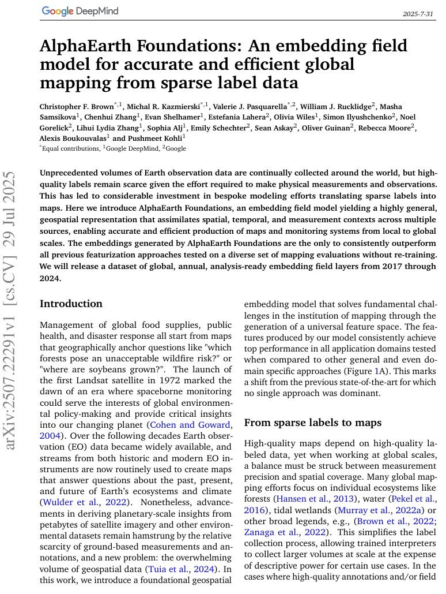
```

---
class: figure-slide, center, inverse, middle

```{r, out.width='57%'}
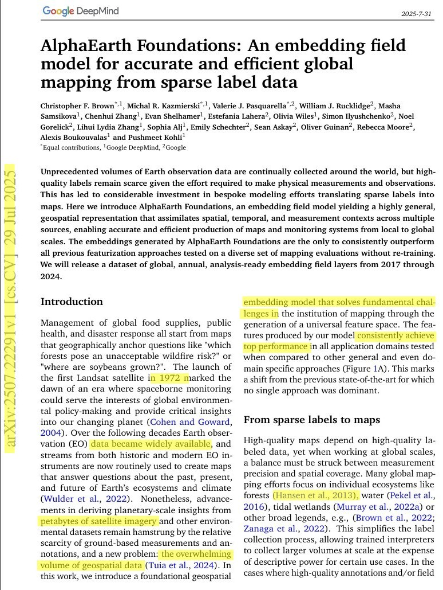
```

---
class: figure-slide, inverse, middle

```{r}
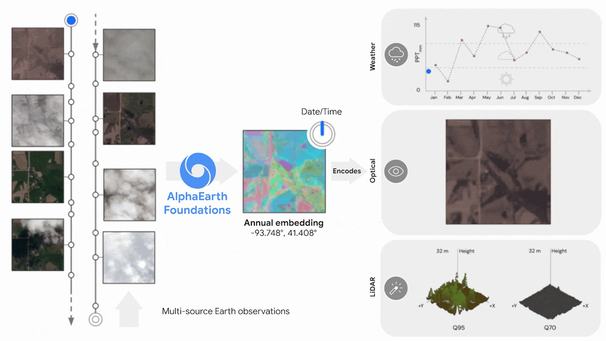
```

---
class: figure-slide, inverse, middle

```{r, out.width='65%'}
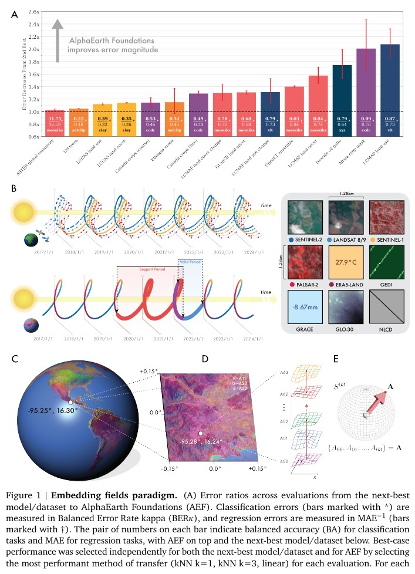
```

---
class: figure-slide, inverse, middle

```{r, out.width='88%'}
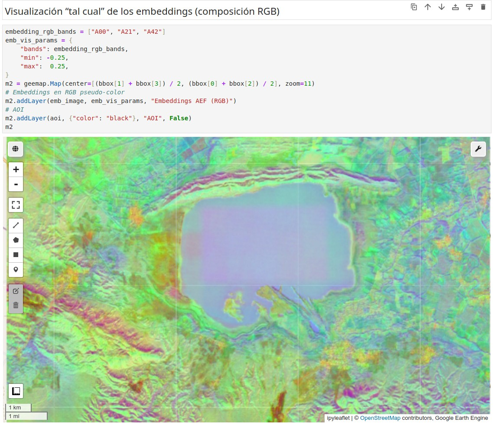
```

---
class: large

# Objetivos

- Objetivo general: evaluar la utilidad práctica de los **embeddings de AlphaEarth Foundations** para apoyar diferentes procesos de análisis espacial en contextos ecológicos y territoriales de la República Dominicana. 

- Objetivos específicos:
  - Probar su desempeño en la modelación de la **distribución espacial de especies** empleando registros de presencia y técnicas de aprendizaje supervisado.
  - Evaluar la capacidad para **discriminar coberturas** en zonas agrícolas, forestales y urbanas.
  - Analizar su aplicación en el **diseño de muestreo estratificado**, utilizando la similitud entre embeddings para optimizar la representatividad espacial y ambiental

---
class: large, center, middle, inverse

# Objetivo 1

Probar desempeño de embeddings de AEF en la modelación de la **distribución espacial de especies** empleando registros de presencia y técnicas de aprendizaje supervisado.

Colaboración para mis estudiantes del semestre 2023-02, asignatura biogeografía: Adrián Montás, Ángel González, Arisleydi De la Cruz, Bryan Ramos, Claribel Ramírez, Manuel Reyes, Ramona Muñoz, Saderis Carmona, Yenny Santana

---
class: figure-slide, inverse, middle, center

```{r, out.width='75%'}
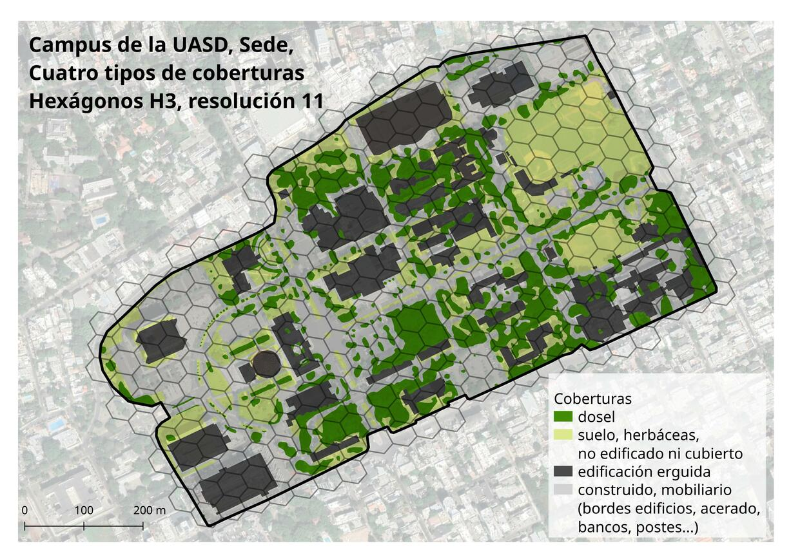
```

---
class: figure-slide, inverse, middle, center

```{r, out.width='75%'}
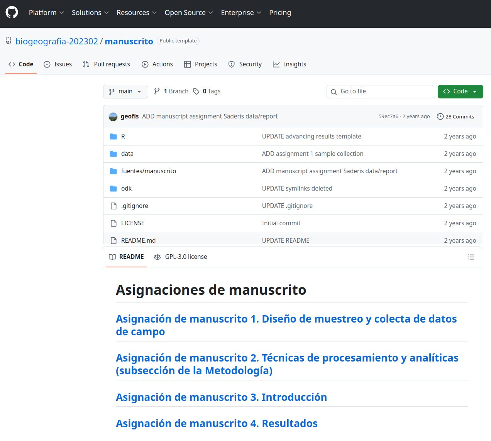
```
Autor: Adrían Diplán.

---
class: figure-slide, inverse, middle, center

```{r}
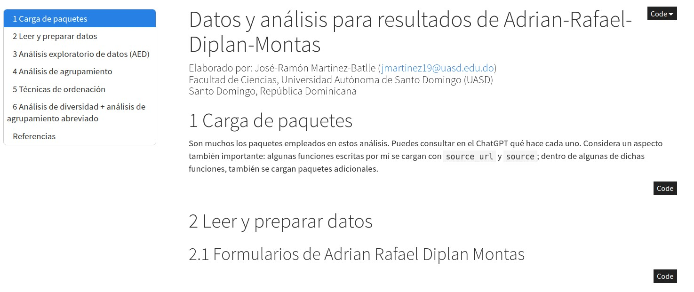
```
Autor: Adrían Diplán.

---
class: figure-slide, inverse, middle, center

```{r}
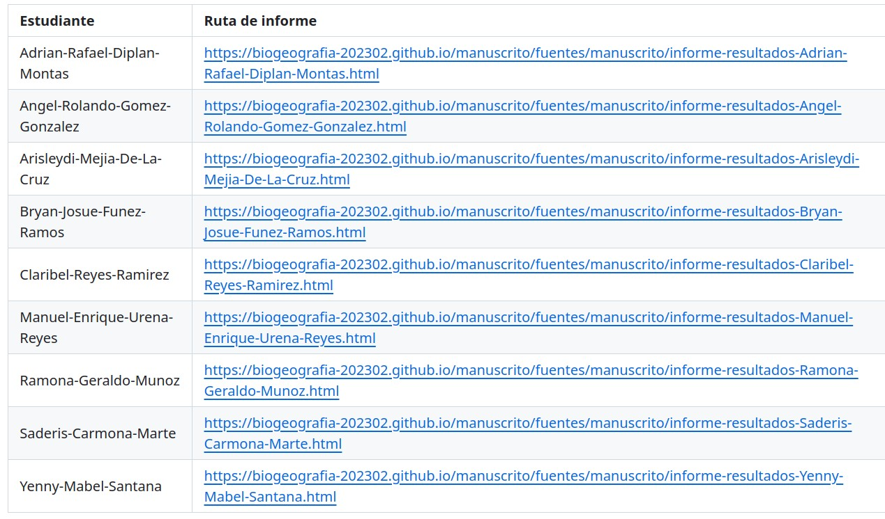
```
Autor: Adrían Diplán.

---
class: figure-slide, inverse, middle, center

```{r, out.width='90%'}
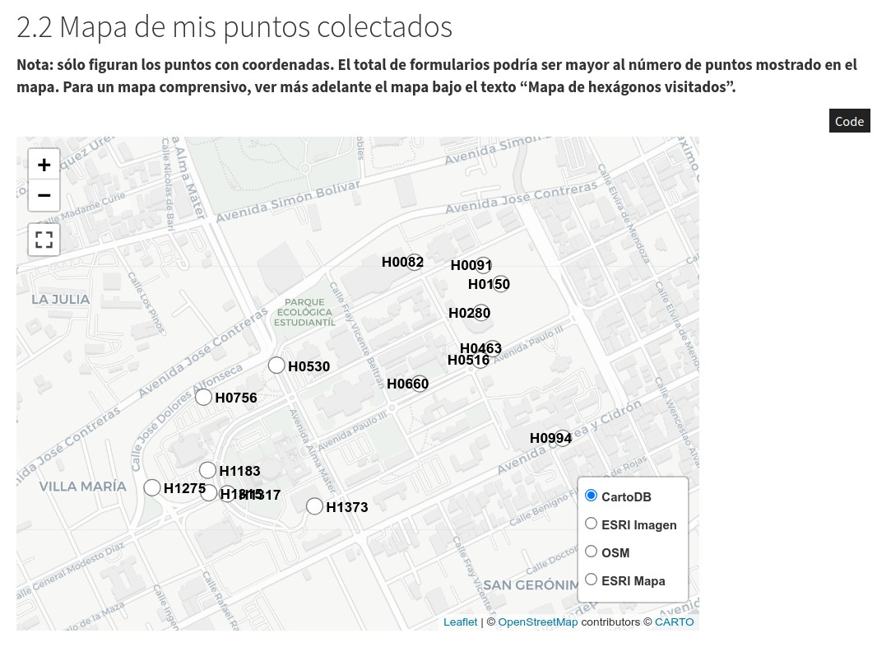
```
Autor: Adrían Diplán.

---
class: figure-slide, inverse, middle, center

```{r, out.width='80%'}
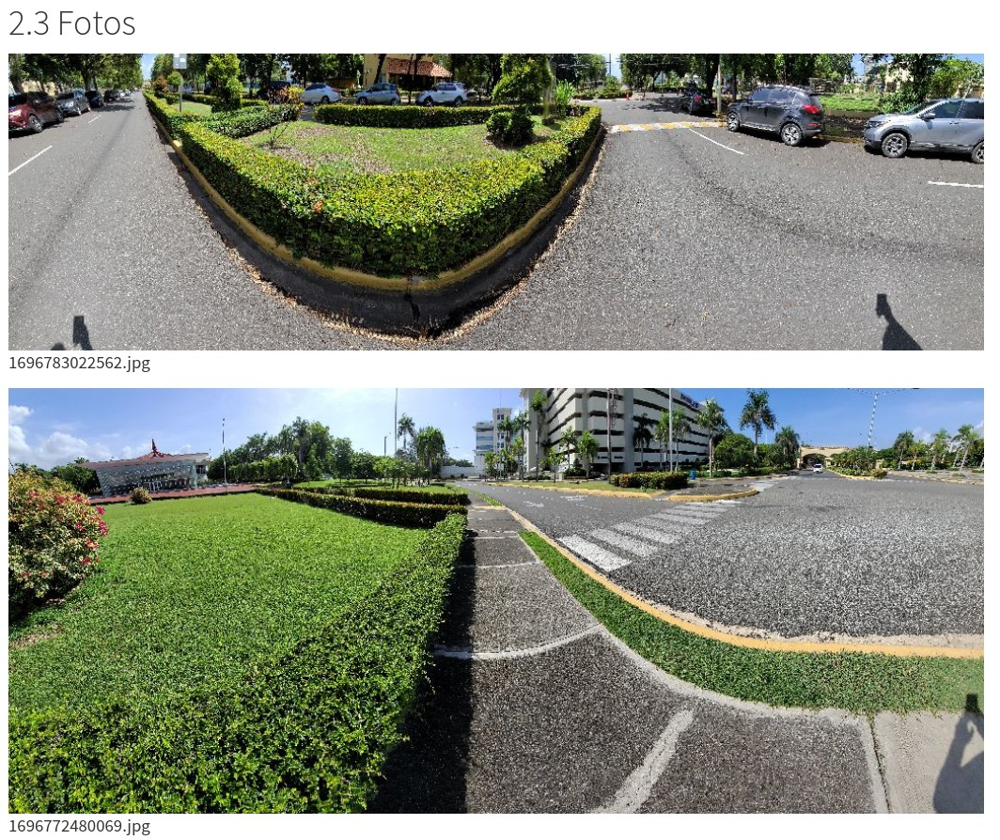
```
Autor: Adrían Diplán.

---
class: figure-slide, inverse, middle

```{r}
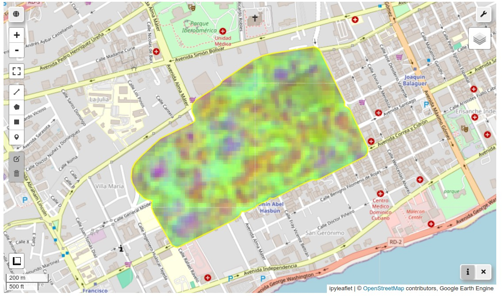
```

---
class: figure-slide, inverse, middle

```{r, out.width='95%'}
knitr::include_graphics('registros_pa_brachymyrmex_uasd.jpg')
```

---
class: figure-slide, inverse, middle

```{r, out.width='70%'}
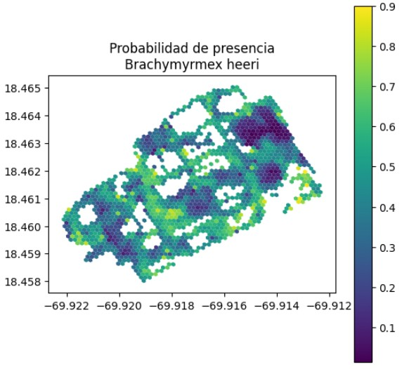
```

---
class: figure-slide, inverse, middle

```{r, out.width='70%'}
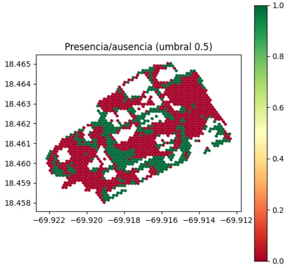
```

---
class: figure-slide, inverse, middle

```{r, out.width='50%'}
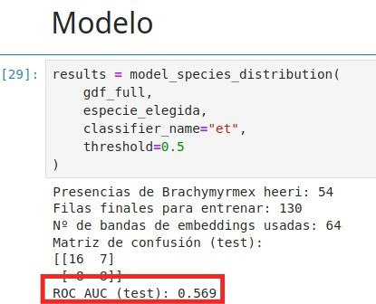
```

---
class: figure-slide, inverse, middle

```{r, out.width='60%'}
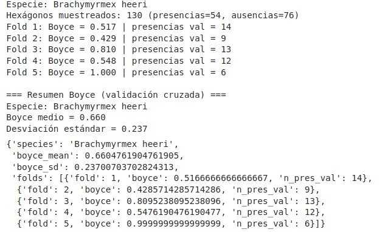
```

---
class: large

# Conclusiones del Objetivo 1

- **Los embeddings AEF reflejan gradientes ambientales finos** dentro del campus, capturando variación espacial relevante, **incluso sin usar datos de cobertura preexistentes y *con muestra pequeña***.

- **La extracción de patrones ambientales por hexágono H3 fue exitosa**, generando una base homogénea para integrar las presencias.

- **Los modelos exploratorios muestran potencial predictivo** de los embeddings como variables para la distribución

---
class: large, center, middle, inverse

# Objetivo 2

Evaluar la capacidad de los embeddings satelitales de Google AEF para discriminar coberturas agrícolas, forestales y urbanas

Colaboración para Kénnida Polanco.

---
class: large

# Contexto

Para este objetivo se seleccionó un área con presencia simultánea de:

- **Agroecosistemas**
- **Bosque seco / matorral** (clases forestales/arbustivas)
- **Humedales** (varias)
- **Áreas urbanizadas**

---
class: large

# Flujo metodológico general

A continuación se muestra el resumen metodológico seguido para este objetivo, basado en tres componentes:

1. **Obtención de las máscaras de entrenamiento** mediante SAM (Segment Anything) usando el cuaderno adaptado de *Qiusheng Wu*, paquetes `samgeo`, `geemap`, en Google Colab.
2. **Curación y unificación de clases** en QGIS.
3. **Clasificación supervisada con embeddings AEF** mediante Random Forest y validación cruzada *k-folds* en Google Earth Engine.


---
class: large, center, middle, inverse

# Metodología

---
class: figure-slide, inverse, middle

```{r, warning=F, message=F, echo=F}
library(magick)

# Leer el PDF (puedes indicar página con [1], [2], etc.)
pdf_img <- image_read_pdf("graphical-methodology.pdf",
                          density = 300)  # density mejora resolución

# Guardar como JPG
image_write(pdf_img, path = "graphical-methodology.jpg", format = "jpg")
```


---
class: figure-slide, center, inverse, middle

```{r, out.width='50%'}
knitr::include_graphics('capturas_4.jpg')
```

---
class: large

## 1. Obtención de imágenes de alta resolución (ESRI World Imagery)

Se descargó una imagen de referencia del área seleccionada empleando *ESRI World Imagery* con resolución aproximada de **5–10 m**, de manera que fuera coherente con la escala representada en los embeddings AEF.

---
class: large

## 2. Segmentación automática con Segment Anything (SAM)

La segmentación se realizó usando cuaderno Jupyter. El procesamiento incluyó:

* Uso del modelo **ViT-H** (SAM), adecuado para imágenes de alta resolución pero útil también para imágenes de mediana resolución. Eficiente por su relación sensibilidad–costo computacional.
* Aplicación de `sam.generate()` con `unique=True` para obtener **instancias diferenciadas**.
* Ajuste de hiperparámetros (`points_per_side`, `pred_iou_thresh`, `crop_n_layers`, etc.) para aumentar la densidad de máscaras.

---
class: figure-slide, inverse, middle

```{r}
knitr::include_graphics('samgeo-vit-h-generate-mask-kwargs.jpg')
```

---
class: figure-slide, inverse, middle

```{r}
knitr::include_graphics('salida-seriada.gif')
```

---

## 3. Limpieza y edición mínima en QGIS

Las máscaras obtenidas se exportaron a GeoPackage, donde se realizó una edición mínima:

* Corrección de pequeñas islas y polígonos erróneos.
* Eliminación de duplicados.
* Fusión de parches contiguos cuando correspondían a una misma cobertura.

Se añadieron dos campos:

* `class_id` (entero 1–8)
* `class_label` (nombre de la clase)

---
class: figure-slide, inverse, middle

```{r}
knitr::include_graphics('mascaras_entrenamiento_qgis_color.jpg')
```

---
class: large

## 4. Clasificación supervisada con embeddings AEF en Google Earth Engine

### Pasos principales

* Se definió un **AOI** a partir del *buffer de 1 km* del socioecosistema.
* Se extrajeron los embeddings mediante:

```{python, echo=T, eval=F}
emb_image = ee.Image("GOOGLE/AE/IMG_V1").clip(aoi)
```

* Se muestrearon los píxeles según los polígonos curados:

```{python, echo=T, eval=F}
sample = emb_image.sampleRegions(
    collection=fc,
    properties=["class_id"],
    scale=40,   # ajustado para evitar EEException: memory exceeded
    geometries=False
)
```

---
class: large

* Se añadieron **5 folds** para validación cruzada:

```{python, echo=T, eval=F}
sample = sample.randomColumn("rand").divide(k).int()
```

* Se entrenó un clasificador:

```{python, echo=T, eval=F}
classifier = ee.Classifier.smileRandomForest(
    numberOfTrees=100,
    minLeafPopulation=5
)
```

---
class: large

## 5. Resultados de la validación cruzada (5-fold CV)

Los resultados fueron evaluados en términos de:

* **Kappa de Cohen**
* **Exactitud global (OA)**
* **Matriz de confusión por pliegue**

---
class: figure-slide, inverse, middle

```{r, out.width='97%'}
knitr::include_graphics('metricas-k-fold-cv.jpg')
```

---
class: large, center, middle, inverse

# Mapa de clasificación

---
class: figure-slide, inverse, middle

```{r}
knitr::include_graphics('mapa_clasificacion.jpg')
```

---
class: large

# Conclusiones del Objetivo 2

* Los embeddings de AEF **sí capturan diferencias estructurales** entre agroecosistemas, áreas forestales/arbustivas y zonas urbanas.
* Con solo unos pocos polígonos de entrenamiento (segmentados vía SAM), se logró una clasificación robusta.
* El uso combinado de **SAM + QGIS + AEF embeddings + Random Forest** constituye un flujo de trabajo reproducible y eficiente para análisis de cobertura sin necesidad de deep learning complejo.
* La validación cruzada mostró niveles consistentes de desempeño entre pliegues, indicando estabilidad del clasificador.

---
class: large, center, middle, inverse

# Objetivo 3

Analizar la aplicación de embeddings de AEF en el **diseño de muestreo estratificado**, utilizando la similitud entre embeddings para optimizar la representatividad espacial y ambiental

Colaboración para María Fernanda Rodríguez y Wellin Brito.

---
class: figure-slide, inverse, middle

```{r, warning=F, message=F, echo=F}
library(magick)

# Leer el PDF (puedes indicar página con [1], [2], etc.)
pdf_img <- image_read_pdf("graphical-methodology-don-gregorio.pdf",
                          density = 300)  # density mejora resolución

# Guardar como JPG
image_write(pdf_img, path = "graphical-methodology-don-gregorio.jpg", format = "jpg")
```


```{r, out.width='95%'}
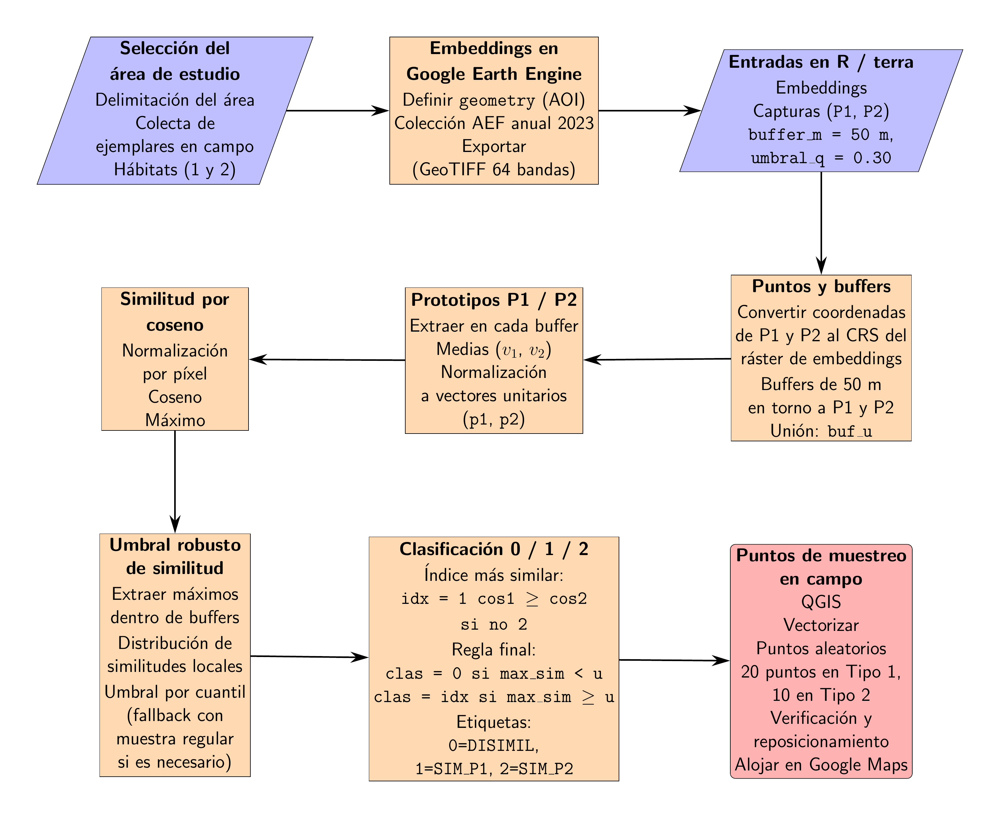
```

---
class: figure-slide, inverse, middle

```{r}
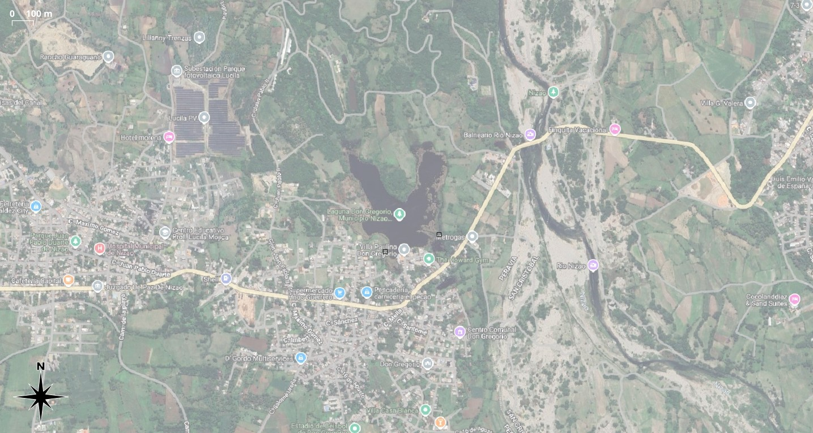
```

---
class: figure-slide, inverse, middle

```{r}
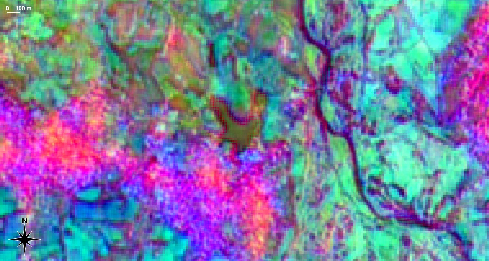
```

---
class: figure-slide, inverse, middle

```{r}
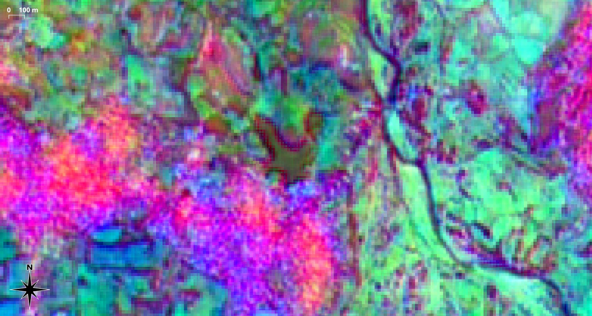
```

---
class: figure-slide, inverse, middle

```{r}
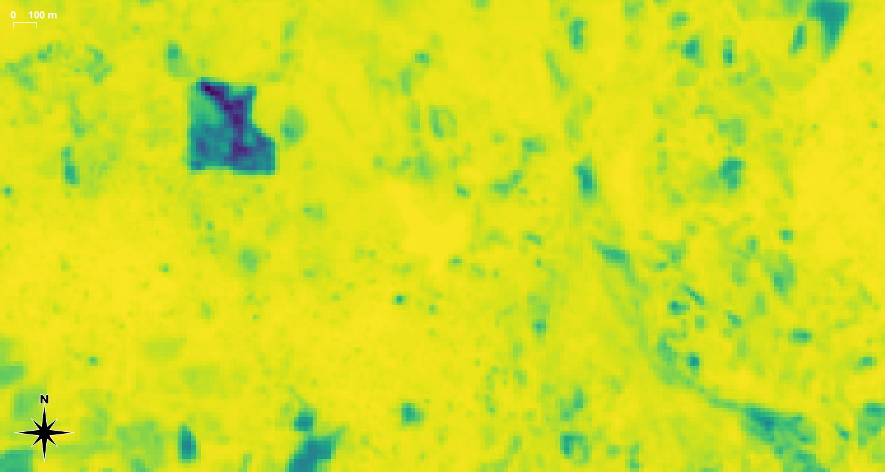
```

---
class: figure-slide, inverse, middle

```{r}

```

---
class: figure-slide, inverse, middle

```{r}
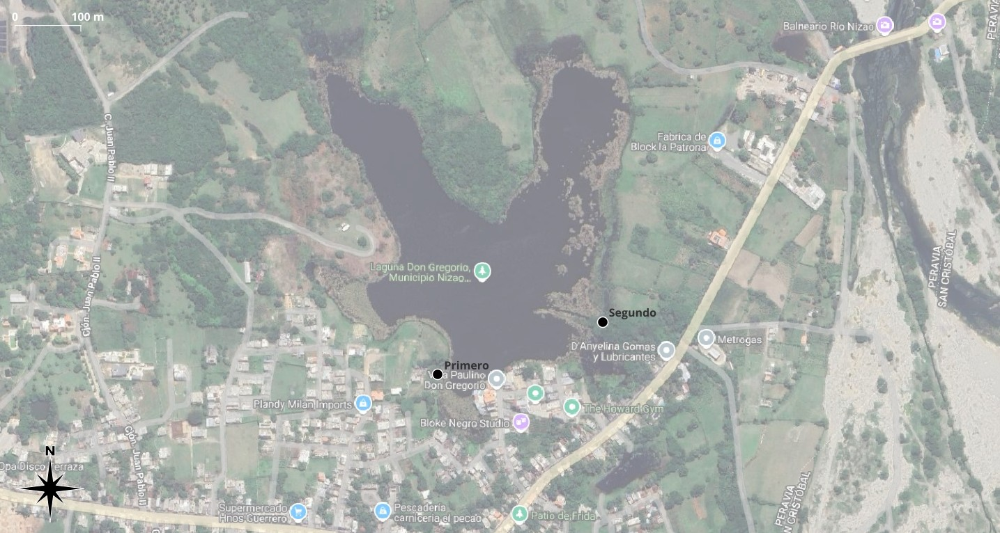
```

---
class: figure-slide, inverse, middle

```{r}
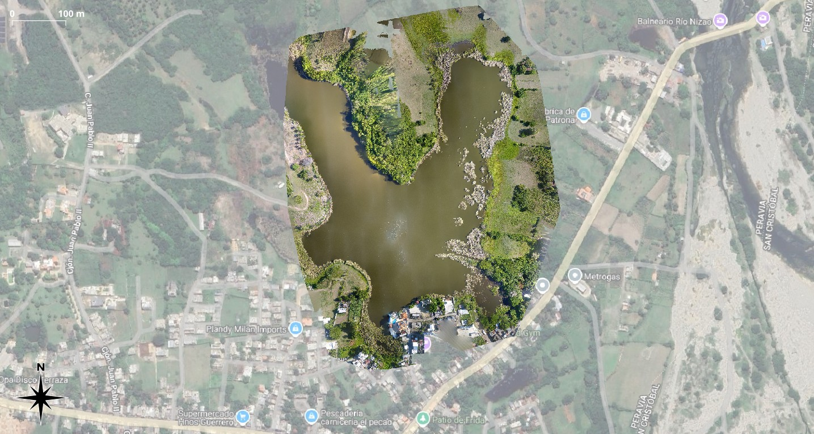
```

---
class: figure-slide, inverse, middle

```{r}
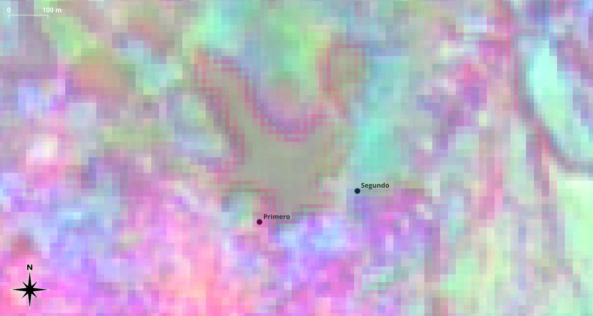
```

---
class: figure-slide, inverse, middle

```{r}
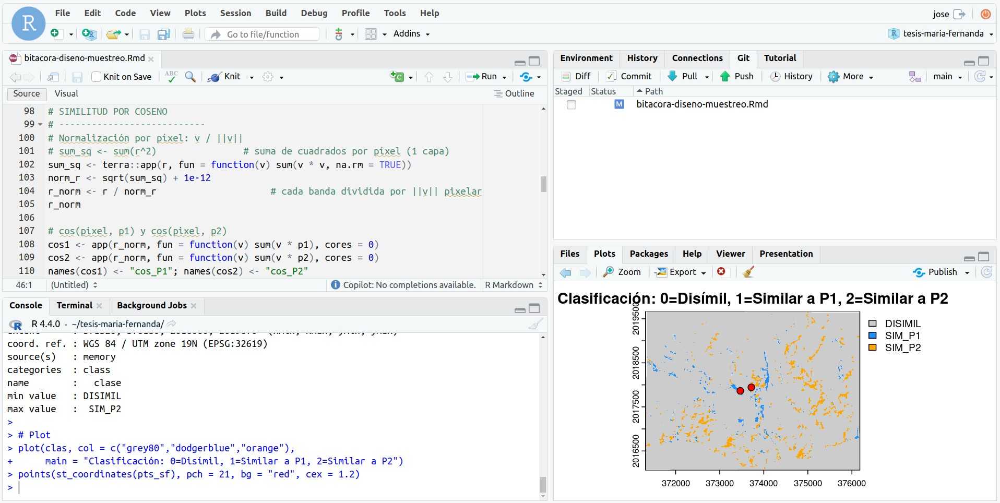
```

---
class: figure-slide, inverse, middle

```{r}
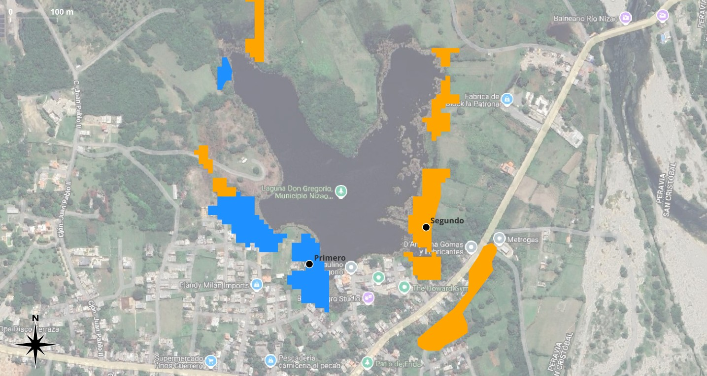
```

---
class: figure-slide, inverse, middle

```{r}
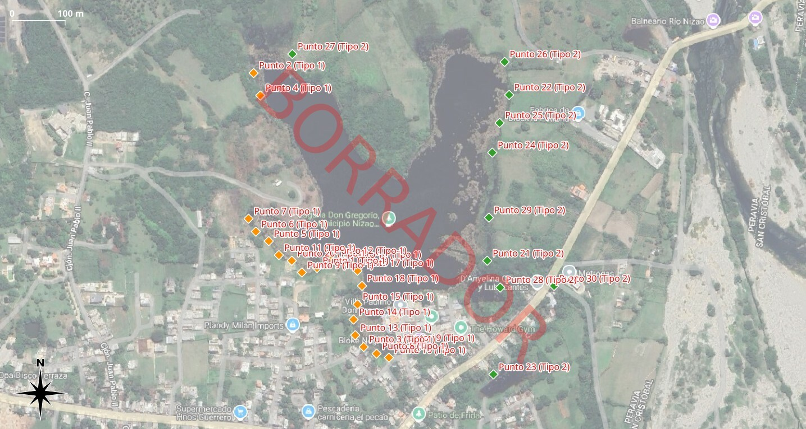
```

---
class: figure-slide, inverse, middle

```{r, out.width='100%'}
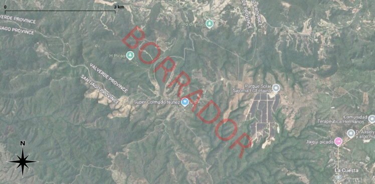
```

---
class: large

# Conclusiones del Objetivo 3

- **Los embeddings AEF permiten definir estratos ambientales** sin mapas previos, usando solo similitud por coseno.

- **El umbral aprendido localmente genera estratos estables**, coherentes con los hábitats asociados a los puntos de terreno.

- **El muestreo estratificado resultante es más representativo**, asignando puntos según la estructura ambiental real del área.

---
class: large, inverse, center, middle

# Gracias por su atención

<section style="font-size: 36px; text-align: center;">

<br>

 jmartinez19@uasd.edu.do

<br>

 geofis

</section>

